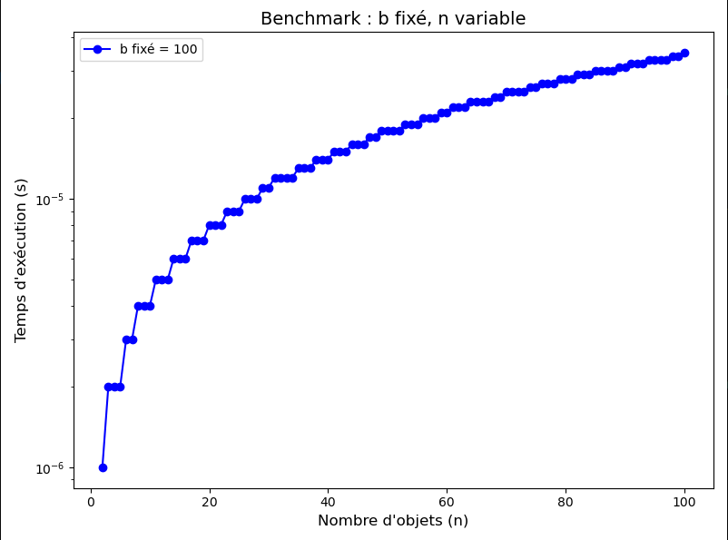
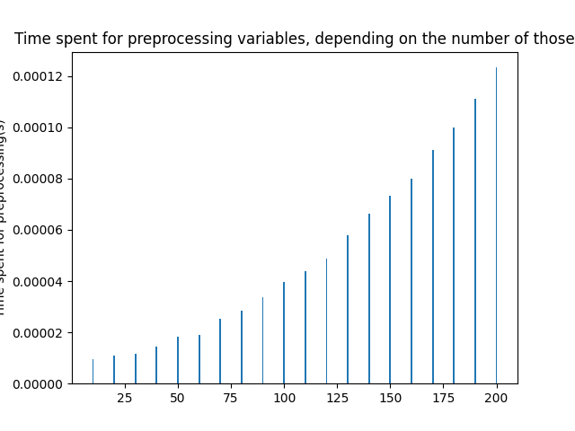

## TP1

### Question 1 :
Il s'agit de la fonction create_instance_file qui
prend en paramètre un fichier, une seed pour l'aléatoire,
b et n. Si le b ou n donné vaut -1,
il le prend aléatoirement selon les bornes données dans l'énoncé.
On génere ensuite aléatoirement pour chaque objet le cout (borné par une constante) 
et le poids (borné par b). On a une deuxième version qui crée et le renvoie (ce qui est plus utile pour les benchmarks).

### Question 2 :
Cf fonction KP_LP (modifiée pour renvoyer une structure représentant mieux le résultat).

### Question 3 :
Cf fonction KP_Greedy (même modification que précédemment).

### Question 4 :
On cherche à savoir comment $n$ et $b$ affectent la compléxité, comme le pire cas est que $b$ soit grand et que tout 
les objets soient alors parcourus, on en déduis que $b$ a bien un impact sur la complexité mais le nombre d'itération 
reste borné au pire cas par $n$. On peut alors simplifier la compléxité en $O(n +tri)$. Comme dans l'implémentation,
on utilise un tri fusion afin de pouvoir plus facilement tracer les variables et on a donc une compléxité en $O(n^2)$.
On a essayé en faisant 1,000 puis 1,000,000 iterations lors de notre benchmark. 

#### 1)
D'abord en relaxation linéaire (figure \ref{lrn_1})

Il n'y a pas de tendance, on peut extrapoler une droite constante. 
Ceci est confirmé par la courbe associée à un plus grand nombre d'iterations :

Ensuite en glouton :

On remarque le même comportement.

#### 2)
D'abord en relaxation linéaire :

On remarque que contrairement à $b$, la valeur de $n$ a une influence directe sur le temps d'éxécution.

Ensuite en glouton :

On remarque le même comportement. La courbe observée n'est pas linéaire mais ressemble à une courbe polynomiale
ce qui correspond à notre hypothèse.

### Conclusion TP1 :
On ne remarque pas de différence majeur entre les deux algorithmes et c'est normal car ils on le même comportement 
la relaxation linéaire peut être facilement altérée pour ne plus être limité à une seule occurence du même objet).
Comme proposé plus haut c'est $n$ qui détermine la compléxité temporelle (en pire cas) et non pas $b$ (qui peut en 
revanche raccourcir le temps d'éxéction dans certain cas) et c'est la compléxité du tri qui détermine la complexité 
de l'algo, on peut alors l'implémenter en $O(n\log (n))$ avec un tri plus efficace.

---

## TP2

### Question 1 :

De la même manière que pour le TP1. C'est la fonction create_instance_file 
qui prend en paramètre un fichier et qui génère les exemples pour $n \le 100$ et $b \le 1000$.

### Question 2 :

La fonction sort_items et compare_ratios assure le tri décroissant des objects selon leur rapport 
$c_1/a_1 \geq c_2/a_2 \geq \cdots \geq c_n/ a_n$.
Cela permet de considérer en priorité les objets offrant le meilleur rendement (valeur par unité de poids). L’algorithme KP_dynamic sera ainsi appliqué sur un ensemble ordonné, ce qui peut améliorer la propagation des solutions optimales dans le tableau de programmation dynamique.
Cf KP_dynamic.

#### 1)

#### 2)

Remarque :
On constate que lorsque n est très faible, le temps d’exécution est dominé par le “bruit” d’exécution
(appels système, initialisations, etc.), ce qui créer une augmentation assez rapide des temps d'executions.

### Conclusion TP2 :
**n Fixé, b Variable :**
-   *Hypothèse  :* 
    Lorsque le nombre d'objets n est maintenu constant, la complexité théorique de l'algorithme est proportionnelle à b, 
c'est-à-dire $O(n\times b)$ se réduit à $O(b)$ pour n fixé.
-   *Observations  :*  
    Les courbes obtenues montrent que, pour un n fixé, 
le temps d'exécution augmente de manière linéaire avec b.
Cela signifie que doubler la capacité du sac entraîne approximativement un doublement 
du temps d'exécution, ce qui est conforme à la théorie.

**b Fixé, n Variable :**
-   *Hypothèse  :*
    Lorsque la capacité b est maintenue constante, la complexité théorique devient $O(n)$. Autrement dit, le temps d'exécution devrait être proportionnel au nombre d'objets n.
-   *Observations  :*
    Les résultats montrent que pour une capacité fixée, l'augmentation du nombre d'objets engendre une croissance linéaire du temps d'exécution. Chaque augmentation d'un certain nombre d'objets se traduit par une augmentation assez proportionnelle du temps, confirmant ainsi le comportement attendu.

Dans l'ensemble, l'algorithme présente une complexité en temps de $O(n\times b)$. Les tests expérimentaux, en isolant 
les deux variables, montrent bien que lorsque l'une est fixée, le temps d'exécution varie linéairement avec l'autre.

---

## TP3

Dans ce TP, on essaye de traiter les variables afin d'en éliminer certaine en vu d'une 
résolution linéaire. 

Voici, en fig.\ref{TP3/preprocessed}, un graphique représentant la proportion de variable réduite selon le nombre de variables. 

On observe ainsi que la proportion de variable affectées par le pre-processing
diminue lorsque que la taille (le nombre d'objet) du problème augmente. 

On remarque aussi, lors de l'exécution et de facon contre-intuitive, que le nombre
de variables affectés diminue aussi. 

Avec notre implémentation, l'amélioration des performances est existente mais minime (de l'ordre de
quelques millisecondes).
Cependant,
on observe, avec la fig.\ref{TP3/time} très clairement (et de façon plutôt logique)
une augmentation du temps de pre-processing en augmentant le nombre de variable

Le preprocessing de variable semble être un moyen prometteur pour réduire la charge de calcul
lors de l'optimisation linéaire. 

## Conclusion
Ces TPs nous ont permis de mieux appréhender les concepts vu en cours ainsi qu'étudier les méthode d'optimisation sur 
un problème relativement simple mais pouvant être généralisé.